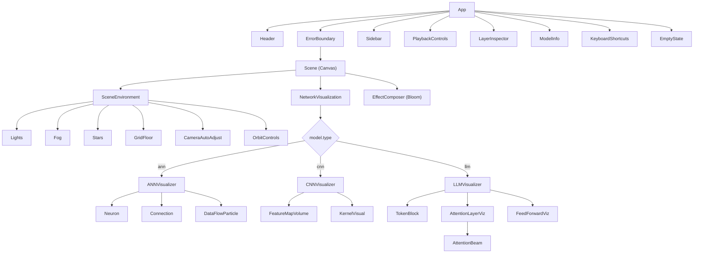
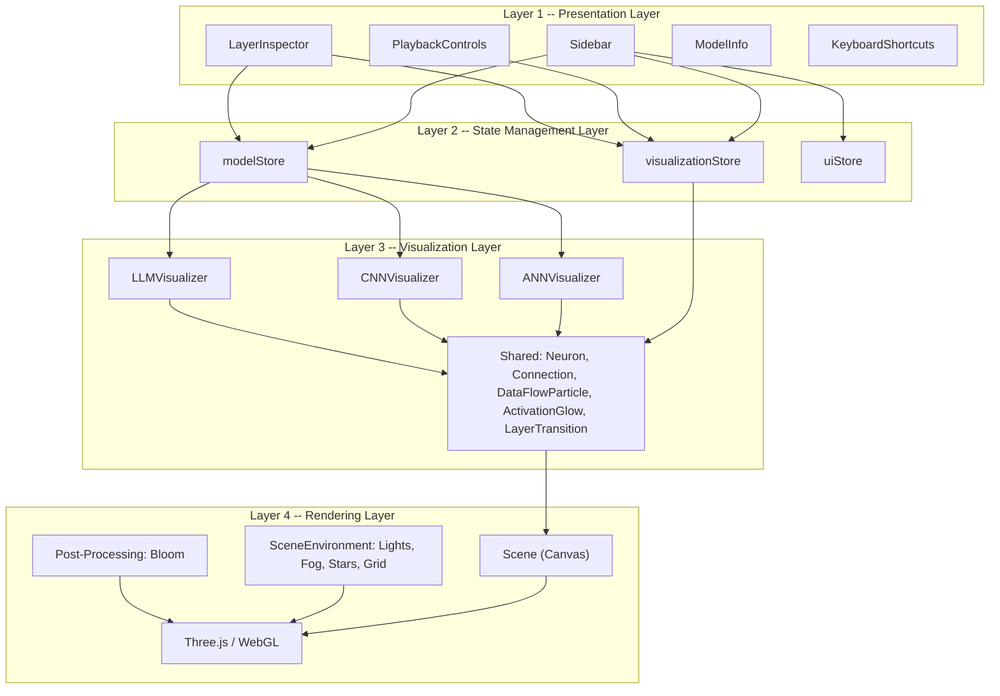
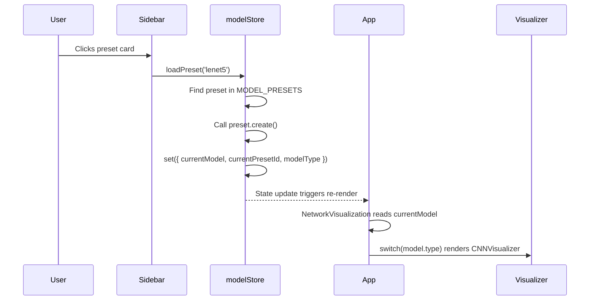
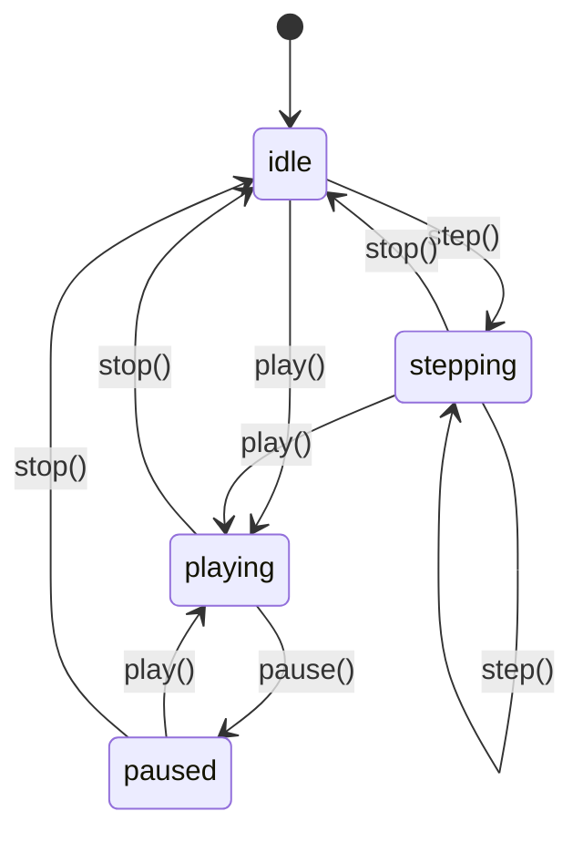
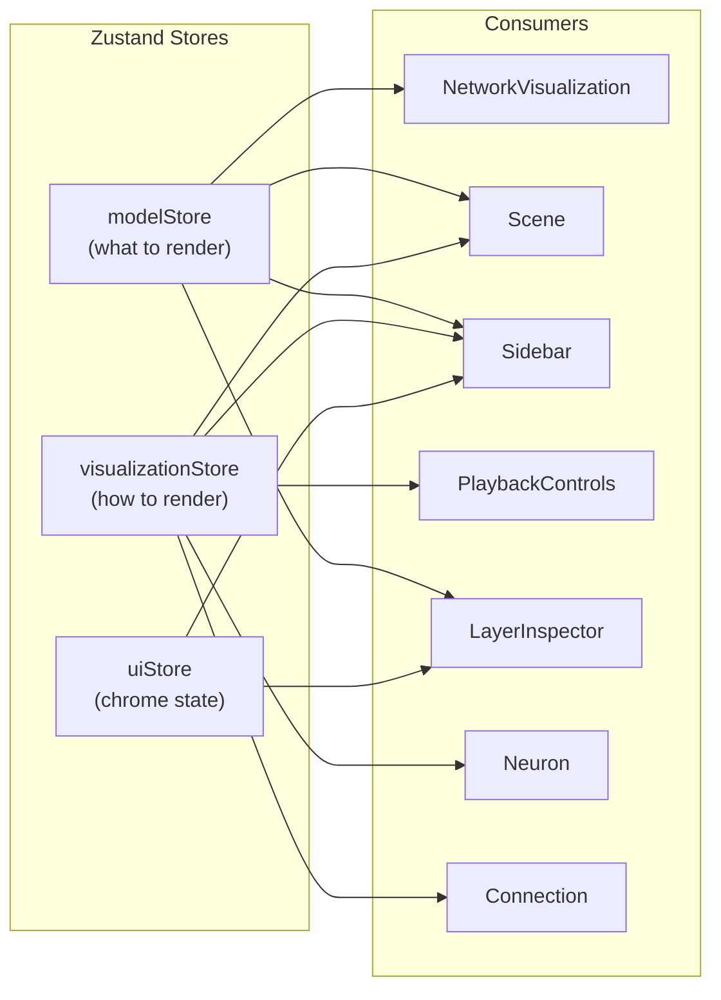
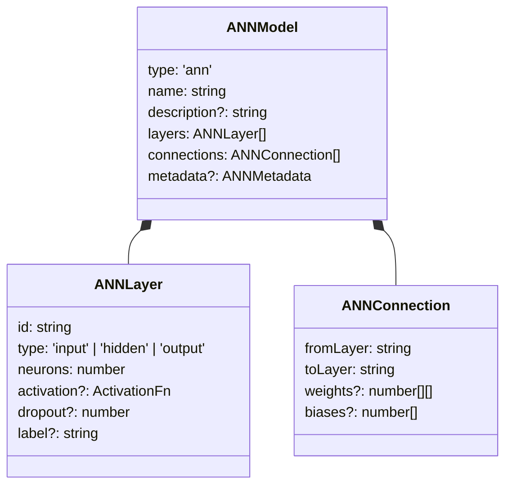
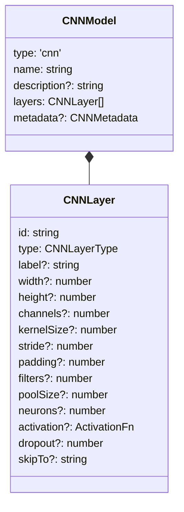
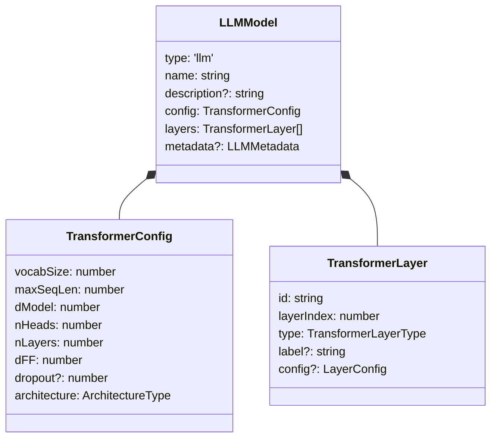

# 3D Neural Network Visualizer -- Architecture Documentation

> **Version:** 1.0
> **Last Updated:** February 2026
> **Tech Stack:** React 19, Three.js 0.182, React Three Fiber 9, Zustand 5, Vite 7, TypeScript 5.9, Tailwind CSS 4

---

## Table of Contents

1. [System Overview](#1-system-overview)
2. [Layer Architecture](#2-layer-architecture)
3. [State Management](#3-state-management)
4. [Model Schema System](#4-model-schema-system)
5. [3D Rendering Pipeline](#5-3d-rendering-pipeline)
6. [Animation System](#6-animation-system)
7. [Performance Strategy](#7-performance-strategy)
8. [Error Handling](#8-error-handling)
9. [Extending the System](#9-extending-the-system)

---

## 1. System Overview

The 3D Neural Network Visualizer is an interactive, browser-based tool that renders neural network architectures (ANN, CNN, LLM/Transformer) as explorable 3D scenes. Users select a model preset from the sidebar, the corresponding schema is instantiated, and a dedicated visualizer maps the model definition into Three.js geometry inside a React Three Fiber canvas.

### High-Level Data Flow

```
 User Interaction           State Layer              Visualization Layer          Rendering Layer
 ==================    ===================    ============================    ====================

 +------------+        +---------------+       +-----------------------+      +-----------------+
 |  Sidebar   | -----> |  modelStore   | ----> | NetworkVisualization  | ---> |     Canvas      |
 | (presets,  |        | (currentModel,|       | switch(model.type)    |      | (WebGL context) |
 |  tabs,     |        |  modelType,   |       |   'ann' -> ANN...     |      |                 |
 |  settings) |        |  presetId)    |       |   'cnn' -> CNN...     |      |  Scene          |
 +-----+------+        +-------+-------+       |   'llm' -> LLM...    |      |  - Lights       |
       |                       |               +-----------+-----------+      |  - Fog          |
       |                       |                           |                  |  - Stars        |
 +-----v------+        +-------v---------+     +-----------v-----------+      |  - Grid         |
 | Playback   | -----> | visualization   |     | Shared Components     |      |  - OrbitControls|
 | Controls   |        |   Store         | --> | - Neuron              |      |  - PostProcessing|
 | (play,     |        | (animation,     |     | - Connection          |      |    (Bloom)      |
 |  pause,    |        |  visual flags,  |     | - DataFlowParticle    |      +-----------------+
 |  speed,    |        |  glow, opacity) |     | - ActivationGlow      |
 |  toggles)  |        +-----------------+     | - LayerTransition     |
 +-----+------+                                +-----------------------+
       |
 +-----v------+        +---------------+
 | Layer      | -----> |   uiStore     |
 | Inspector  |        | (sidebar,     |
 | ModelInfo  |        |  inspector,   |
 | Shortcuts  |        |  tooltip)     |
 +------------+        +---------------+
```

### Component Tree



### Key Source Files

| File | Purpose |
|------|---------|
| `src/main.tsx` | Application entry point; mounts React root in StrictMode |
| `src/App.tsx` | Root component; composes Scene, UI overlays, keyboard shortcuts |
| `src/components/canvas/Scene.tsx` | R3F Canvas setup; environment, post-processing, performance |
| `src/stores/modelStore.ts` | Model state: current model, presets, loading |
| `src/stores/visualizationStore.ts` | Animation and visual state: play/pause, glow, toggles |
| `src/stores/uiStore.ts` | UI chrome state: sidebar, inspector, tooltips |
| `src/models/ann-schema.ts` | ANN type definitions and preset factories |
| `src/models/cnn-schema.ts` | CNN type definitions and preset factories |
| `src/models/llm-schema.ts` | LLM/Transformer type definitions and preset factories |

---

## 2. Layer Architecture

The application is organized into four distinct architectural layers, each with clear responsibilities and boundaries.



### Layer 1: Presentation Layer (React UI Components)

Standard React DOM components overlaid on the 3D canvas using absolute positioning and `z-index` layering. These components are purely 2D HTML/CSS and communicate with the 3D world exclusively through Zustand stores.

| Component | File | Responsibility |
|-----------|------|----------------|
| `Sidebar` | `src/components/ui/Sidebar.tsx` | Model type tabs, preset selection, visualization settings sliders |
| `PlaybackControls` | `src/components/ui/PlaybackControls.tsx` | Play/pause/stop/step, speed slider, data flow toggle |
| `LayerInspector` | `src/components/ui/LayerInspector.tsx` | Detailed info panel for the selected layer |
| `ModelInfo` | `src/components/ui/ModelInfo.tsx` | Model metadata display (name, parameters, dataset) |
| `KeyboardShortcuts` | `src/components/ui/KeyboardShortcuts.tsx` | Visual overlay showing available keyboard bindings |

**Design Pattern:** All UI components use glass-morphism styling (`glass-panel` CSS class) with CSS custom properties defined in `globals.css`. They are rendered as siblings to the Canvas and use `pointer-events: none/auto` strategically to allow click-through to the 3D scene.

### Layer 2: State Management Layer (Zustand Stores)

Three Zustand stores act as the single source of truth. They are decoupled from both the UI and the 3D rendering, enabling any component in either world to read or write state.

See [Section 3: State Management](#3-state-management) for full details.

### Layer 3: Visualization Layer (R3F Visualizer Components)

These are React Three Fiber components that live inside the `<Canvas>` tree. They read model data from the `modelStore` and visual settings from the `visualizationStore`, then declaratively produce Three.js scene graphs.

Each model type has a dedicated top-level visualizer:

- **`ANNVisualizer`** -- Maps `ANNModel` layers to grids of `Neuron` spheres connected by `Connection` curves.
- **`CNNVisualizer`** -- Maps `CNNModel` layers to `FeatureMapVolume` boxes (RoundedBox) with arrows and skip connections.
- **`LLMVisualizer`** -- Maps `LLMModel` layers to `TokenBlock` elements, `AttentionLayerViz` with attention beams, and `FeedForwardViz` expansion tunnels.

Shared primitive components (`Neuron`, `Connection`, `DataFlowParticle`, `ActivationGlow`, `LayerTransition`) are used across visualizers.

### Layer 4: Rendering Layer (Three.js / WebGL)

The lowest layer is the Three.js runtime inside a React Three Fiber `<Canvas>`. It manages the WebGL context, render loop, and post-processing.

| Concern | Implementation |
|---------|----------------|
| Canvas setup | `<Canvas dpr={dpr} gl={{ antialias: true, alpha: false }}>` |
| Lighting | Ambient (0.15) + 2 point lights (blue #4fc3f7, purple #b388ff) + directional |
| Fog | Linear fog `#0a0a0f` from 40 to 120 units |
| Background | Star field via `<Stars>` from drei |
| Ground plane | `<Grid>` with cell and section lines, fade at 50 units |
| Camera control | `<OrbitControls>` with auto-rotate, damping, distance limits |
| Post-processing | `<EffectComposer>` with `<Bloom>` (configurable intensity) |
| Performance | `<PerformanceMonitor>` dynamically adjusts DPR between 1.0 and 2.0 |

---

## 3. State Management

The application uses three Zustand stores, each scoped to a specific domain. All stores are created with `create<T>()` from Zustand 5 and export a `use...Store` hook. Components subscribe to individual selectors (e.g., `useModelStore((s) => s.currentModel)`) to minimize unnecessary re-renders.

### 3.1 modelStore

**File:** `src/stores/modelStore.ts`

Manages which neural network model is currently loaded and provides a preset registry.

#### State Shape

```typescript
interface ModelState {
  currentModel: NetworkModel | null;   // The instantiated model object
  currentPresetId: string | null;      // ID of the active preset
  modelType: ModelType;                // 'ann' | 'cnn' | 'llm'

  // Actions
  loadPreset: (presetId: string) => void;
  setModelType: (type: ModelType) => void;
  clearModel: () => void;
}
```

#### Type System

```typescript
type NetworkModel = ANNModel | CNNModel | LLMModel;   // Discriminated union
type ModelType = 'ann' | 'cnn' | 'llm';               // Category selector
```

#### Preset Registry

The `MODEL_PRESETS` array is a static registry of all available model configurations:

```typescript
interface ModelPreset {
  id: string;                    // Unique identifier (e.g., 'simple-mlp')
  name: string;                  // Display name (e.g., 'Simple MLP')
  type: ModelType;               // Category for filtering
  description: string;           // Human-readable summary
  create: () => NetworkModel;    // Factory function
}
```

**Currently registered presets (13 total):**

| Category | Presets |
|----------|---------|
| ANN (4) | Simple MLP, Deep MLP, Autoencoder, XOR Network |
| CNN (4) | LeNet-5, Mini ResNet, AlexNet, VGG-11 |
| LLM (5) | GPT-2 Small, BERT Tiny, Nano Transformer, Tiny Llama, Mini GPT |

#### Loading Flow



### 3.2 visualizationStore

**File:** `src/stores/visualizationStore.ts`

Controls all visual parameters, animation state, and layer selection. This is the most frequently accessed store, read by virtually every 3D component.

#### State Shape

```typescript
interface VisualizationState {
  // Camera
  viewMode: ViewMode;                      // 'orbit' | 'flythrough' | 'inspect'
  autoRotate: boolean;                     // Default: true

  // Animation
  animationState: AnimationState;          // 'idle' | 'playing' | 'paused' | 'stepping'
  animationSpeed: number;                  // Range: 0.1 - 3.0, Default: 1.0
  currentStep: number;                     // Current step index
  totalSteps: number;                      // Total steps available

  // Layer selection
  selectedLayerId: string | null;          // Clicked layer
  hoveredLayerId: string | null;           // Hovered layer
  highlightedConnections: string[];        // Active connection highlights

  // Visual settings
  showWeights: boolean;                    // Default: true
  showActivations: boolean;               // Default: true
  showLabels: boolean;                     // Default: true
  showDataFlow: boolean;                   // Default: false
  glowIntensity: number;                  // Range: 0 - 1, Default: 0.6
  neuronSize: number;                     // Range: 0.5 - 2.0, Default: 1.0
  connectionOpacity: number;              // Range: 0 - 1, Default: 0.4

  // Educational mode
  educationalMode: boolean;               // Default: false

  // Actions (19 total)
  setViewMode, setAutoRotate, play, pause, stop, step,
  setAnimationSpeed, selectLayer, hoverLayer, toggleWeights,
  toggleActivations, toggleLabels, toggleDataFlow,
  setGlowIntensity, setNeuronSize, setConnectionOpacity,
  toggleEducationalMode
}
```

#### Animation State Machine



### 3.3 uiStore

**File:** `src/stores/uiStore.ts`

Manages the state of UI chrome elements -- sidebar visibility, active tabs, inspector panel, and tooltips.

#### State Shape

```typescript
interface UIState {
  sidebarOpen: boolean;                              // Default: true
  sidebarTab: 'models' | 'layers' | 'settings';     // Default: 'models'
  inspectorOpen: boolean;                            // Default: false
  tooltipVisible: boolean;                           // Default: false
  tooltipContent: string;                            // Default: ''
  tooltipPosition: { x: number; y: number };         // Default: { x: 0, y: 0 }

  // Actions
  toggleSidebar: () => void;
  setSidebarTab: (tab) => void;        // Also opens sidebar
  toggleInspector: () => void;
  showTooltip: (content, x, y) => void;
  hideTooltip: () => void;
}
```

### Store Interaction Diagram



---

## 4. Model Schema System

Neural network architectures are defined as TypeScript interfaces with factory functions that produce preset model instances. The system uses a **discriminated union** pattern on the `type` field to ensure type-safe rendering dispatch.

### Discriminated Union

```typescript
// modelStore.ts
type NetworkModel = ANNModel | CNNModel | LLMModel;

// Each model interface has a literal type discriminant:
interface ANNModel { type: 'ann'; ... }
interface CNNModel { type: 'cnn'; ... }
interface LLMModel { type: 'llm'; ... }
```

This enables exhaustive `switch` in `NetworkVisualization`:

```typescript
switch (currentModel.type) {
  case 'ann': return <ANNVisualizer model={currentModel as ANNModel} />;
  case 'cnn': return <CNNVisualizer model={currentModel as CNNModel} />;
  case 'llm': return <LLMVisualizer model={currentModel as LLMModel} />;
}
```

### 4.1 ANN Schema (`src/models/ann-schema.ts`)

Models fully-connected (dense) neural networks with explicit layer and connection definitions.



**Key design decisions:**
- Connections are defined separately from layers, as a list of `{ fromLayer, toLayer }` pairs, allowing non-sequential topologies (e.g., skip connections, encoder-decoder).
- `weights` and `biases` are optional -- the visualizer generates random weights for display when they are not provided.
- Neuron counts are capped at 32 for visual rendering to prevent scene overload.

**Presets:** `createSimpleMLP`, `createDeepMLP`, `createAutoencoder`, `createXOR`

### 4.2 CNN Schema (`src/models/cnn-schema.ts`)

Models convolutional architectures with spatial dimension tracking through each layer.



**Layer types:** `input | conv2d | maxpool | avgpool | batchnorm | dropout | flatten | dense | output`

**Key design decisions:**
- CNN layers are ordered sequentially (no separate connection list) -- connections are implicit from array order.
- Each layer carries its output spatial dimensions (`width`, `height`, `channels`), pre-computed by the preset factory.
- Skip connections use the `skipTo` field to reference a target layer ID, rendered as green lines.
- The visualizer scales volumes using a `0.04` scale factor applied to spatial dimensions.

**Presets:** `createLeNet5`, `createMiniResNet`, `createAlexNet`, `createVGG11`

### 4.3 LLM Schema (`src/models/llm-schema.ts`)

Models transformer architectures with a global configuration object and auto-generated layer sequences.



**Architecture types:** `'encoder-only' | 'decoder-only' | 'encoder-decoder'`

**Layer types:** `'embedding' | 'positional_encoding' | 'attention' | 'feed_forward' | 'layer_norm' | 'output'`

**Key design decisions:**
- The `TransformerConfig` serves as the single source of truth; layers are auto-generated by `generateTransformerLayers()`.
- Each transformer block produces 4 layers: `layer_norm` -> `attention` -> `layer_norm` -> `feed_forward`.
- For visualization clarity, large models are simplified (e.g., GPT-2's 12 layers are shown as 4).
- Token counts are capped at 8 for performance in attention beam visualization.

**Presets:** `createGPT2Small`, `createBERTTiny`, `createNanoTransformer`, `createTinyLlama`, `createMiniGPT`

### Adding a New Architecture

To add a new model type (e.g., a GAN or a Diffusion model):

1. **Create the schema** in `src/models/gan-schema.ts`:
   ```typescript
   export interface GANModel {
     type: 'gan';  // <-- discriminant
     name: string;
     layers: GANLayer[];
     // ...
   }
   ```

2. **Update the union** in `src/stores/modelStore.ts`:
   ```typescript
   type NetworkModel = ANNModel | CNNModel | LLMModel | GANModel;
   type ModelType = 'ann' | 'cnn' | 'llm' | 'gan';
   ```

3. **Create preset factories** and register them in `MODEL_PRESETS`.

4. **Build the visualizer** in `src/components/visualizers/gan/GANVisualizer.tsx`.

5. **Add the switch case** in `NetworkVisualization` in `App.tsx`.

6. **Add camera preset** in `Scene.tsx`'s `CAMERA_PRESETS`.

---

## 5. 3D Rendering Pipeline

### 5.1 Scene Setup

**File:** `src/components/canvas/Scene.tsx`

The `Scene` component is the root of the 3D world. It wraps everything in a React Three Fiber `<Canvas>` and sets up the rendering environment.

```
Canvas (dpr=adaptive, antialias, bg=#0a0a0f)
  |
  +-- PerformanceMonitor (DPR: 1.0 <-> 2.0)
       |
       +-- Suspense
            |
            +-- SceneEnvironment
            |    +-- ambientLight (0.15)
            |    +-- pointLight #4fc3f7 (0.8) @ [10,10,10]
            |    +-- pointLight #b388ff (0.4) @ [-10,-10,-5]
            |    +-- directionalLight (0.3) @ [0,5,5]
            |    +-- fog (#0a0a0f, near=40, far=120)
            |    +-- Stars (3000 particles, r=100, depth=50)
            |    +-- GridFloor (80x80, fade@50)
            |    +-- CameraAutoAdjust
            |    +-- OrbitControls (autoRotate, damping, zoom limits)
            |
            +-- {children}  <-- NetworkVisualization injected here
            |
            +-- EffectComposer
                 +-- Bloom (intensity from store, threshold=0.2)
```

#### Camera Presets

Each model type has a tuned camera position and field of view:

| Model Type | Position | FOV |
|------------|----------|-----|
| ANN | `[0, 5, 22]` | 58 |
| CNN | `[0, 8, 18]` | 55 |
| LLM | `[0, 12, 28]` | 52 |

When the model type changes, `CameraAutoAdjust` smoothly animates the camera to the new position using ease-out cubic interpolation over 1200ms.

### 5.2 Shared Components

These primitive components are the building blocks used by all visualizers.

#### Neuron (`src/components/shared/Neuron.tsx`)

Renders a single neuron as a glowing sphere.

- **Geometry:** Shared `SphereGeometry(1, 16, 16)` at module level -- all Neuron instances reuse the same geometry buffer.
- **Material:** `meshStandardMaterial` with emissive glow; intensity varies by selection/hover/activation state.
- **Glow halo:** A second sphere (shared `SphereGeometry(1, 12, 12)`) at 1.4x scale with `BackSide` rendering and low opacity.
- **Animation:** Gentle pulse via `useFrame` -- `scale = size * (1 + sin(t + offset) * 0.05)`.
- **Interaction:** Click to select layer, hover for tooltip (via `<Html>` from drei).

#### Connection (`src/components/shared/Connection.tsx`)

Renders a weighted connection between two points as a curved line.

- **Geometry:** Quadratic Bezier curve with 20 segments; midpoint lifted by 5% of distance for subtle arcing.
- **Material:** `LineBasicMaterial` with opacity = `connectionOpacity * |weight|`.
- **Disposal:** Explicit `geometry.dispose()` and `material.dispose()` on unmount/change via `useEffect` cleanup.
- **Animation:** Optional opacity oscillation via `useFrame` for animated connections.

#### DataFlowParticle (`src/components/shared/DataFlowParticle.tsx`)

Animated particle that flows along a path between two points.

- **Path:** Quadratic Bezier curve between start and end (midpoint lifted 8% of distance).
- **Movement:** `useFrame` callback computes `t = (time * speed + delay) % 2 / 2`, maps to curve position via `curve.getPointAt(t)`.
- **Size pulse:** Scale oscillates with `sin(t * PI)` producing a peak at the midpoint of the path.
- **Visibility:** Hidden when `t` is outside `[0, 1]`.

#### ActivationGlow (`src/components/shared/ActivationGlow.tsx`)

A wrapper component that adds dynamic glow effects to any child element.

- **Dual-sphere glow:** Outer sphere at `glowScale` and inner sphere at `glowScale * 1.3`, both using `BackSide` rendering with `depthWrite: false`.
- **Dynamic mode (playing):** Sine-wave oscillation synced to `animationSpeed` with amplitude proportional to `activation`.
- **Static mode (paused/idle):** Constant glow proportional to `activation * glowIntensity`.

#### LayerTransition (`src/components/shared/LayerTransition.tsx`)

Animated directional connections between layers with flowing particles and arrowheads.

- **Tube:** `TubeGeometry` along a Bezier curve with configurable radius.
- **Arrowhead:** Cone geometry positioned at 98% of the curve, oriented along the tangent.
- **Particles:** `particleCount` spheres flow along the curve at staggered phase offsets, with leading and trailing elements.
- **Animation:** Only visible when `animationState === 'playing'`; speed controlled by `animationSpeed`.

### 5.3 Visualizer Components

#### ANNVisualizer (`src/components/visualizers/ann/ANNVisualizer.tsx`)

Maps an `ANNModel` to a 3D scene of neuron grids connected by curved lines.

**Layout algorithm:**
1. `calculateLayerDepths()` distributes layers along the Z-axis with uniform spacing (6 units).
2. `calculateNeuronPositions()` arranges neurons in a grid (max 16 per row) centered on the layer's Z position.
3. Neurons are capped at 32 per layer for visual clarity; a label shows the true count.

**Connection culling:**
- Maximum 200 connections per layer pair.
- When neuron counts would exceed this, connections are sampled at intervals computed from `sqrt(maxConns)`.

**Data flow particles:**
- Up to 3 particles per inter-layer gap.
- Source and target neurons are randomly selected (stable via `useMemo`).

**Color mapping:**
| Layer Type | Color |
|------------|-------|
| Input | `#4fc3f7` (Light blue) |
| Hidden | Mapped from activation function |
| Output | `#69f0ae` (Green) |

#### CNNVisualizer (`src/components/visualizers/cnn/CNNVisualizer.tsx`)

Maps a `CNNModel` to a pipeline of 3D volumes representing feature maps.

**Layout algorithm:**
1. Each layer is scaled by `0.04` and arranged sequentially along the Z-axis.
2. Spatial layers (`width x height x channels`) become 3D boxes; dense layers use `sqrt(neurons)` for width/height.
3. Spacing is computed as `max(depth, 1) + 1.5`.
4. The entire group is centered by offsetting Z by half the total depth.

**Visual elements:**
- **FeatureMapVolume:** `RoundedBox` with solid fill, wireframe overlay, and glow halo. Clickable for layer selection.
- **KernelVisual:** Small wireframe box adjacent to conv layers showing kernel size.
- **Arrows:** `<Line>` + cone geometry between adjacent layers.
- **Skip connections:** Green lines from `skipTo` source to target layer.

**Color mapping:**
| Layer Type | Color |
|------------|-------|
| Input | `#4fc3f7` (Light blue) |
| Conv2D | `#ff8a65` (Orange) |
| MaxPool/AvgPool | `#ffab40` (Amber) |
| BatchNorm | `#90a4ae` (Blue-grey) |
| Flatten | `#80deea` (Cyan) |
| Dense | `#b388ff` (Purple) |
| Output | `#69f0ae` (Green) |

#### LLMVisualizer (`src/components/visualizers/llm/LLMVisualizer.tsx`)

Maps an `LLMModel` to a vertical stack of transformer blocks.

**Layout algorithm:**
1. Layers are grouped into blocks: each transformer block contains `[layer_norm, attention, layer_norm, feed_forward]`.
2. Standalone layers (embedding, positional encoding, output) are their own blocks.
3. Blocks are stacked vertically with `-5` unit spacing on the Y-axis.

**Visual elements:**
- **TokenBlock:** `RoundedBox` (0.8 x 0.4 x 0.4) with floating animation (`sin(t + offset) * 0.1`), up to 8 tokens displayed.
- **AttentionLayerViz:** Torus rings per attention head + `AttentionBeam` Bezier curves between token positions.
- **AttentionBeam:** Quadratic Bezier curve with opacity oscillation via `useFrame`; color-coded per head index from `ATTENTION_HEAD_COLORS` (12 distinct colors).
- **FeedForwardViz:** Two opposing truncated cones showing the expansion/compression of `dModel -> dFF -> dModel`.
- **Block container:** Semi-transparent `RoundedBox` wrapping attention blocks.

### 5.4 Post-Processing

The `<EffectComposer>` from `@react-three/postprocessing` applies a single Bloom pass:

```typescript
<Bloom
  intensity={glowIntensity}      // From visualizationStore, default 0.6
  luminanceThreshold={0.2}       // Only bright pixels bloom
  luminanceSmoothing={0.9}       // Smooth falloff
  mipmapBlur                     // High-quality blur via mipmaps
/>
```

This creates the characteristic neon glow aesthetic, with emissive materials on neurons, connections, and feature map volumes contributing to the bloom.

---

## 6. Animation System

The animation system operates at three levels: a centralized clock, per-component frame callbacks, and state-driven toggling.

### 6.1 useAnimationLoop Hook

**File:** `src/hooks/useAnimationLoop.ts`

A custom hook that provides a synchronized animation clock for all 3D components.

```typescript
interface AnimationLoopState {
  normalizedTime: number;  // 0-1 cycling value
  elapsed: number;         // Total seconds since playback start
  isPlaying: boolean;      // Derived from animationState
  speed: number;           // Current speed multiplier
}
```

**How it works:**

1. The hook registers a `useFrame` callback inside the R3F render loop.
2. Each frame, it reads the current `animationState` and `animationSpeed` from `visualizationStore.getState()` (non-reactive read for performance).
3. When playing, it accumulates `delta * speed` into an elapsed counter.
4. It computes `normalizedTime = (elapsed / cycleDuration) % 1` as a cycling 0-1 value.
5. State is stored in a `useRef` (not `useState`) to avoid triggering React re-renders on every frame.
6. Delta is clamped to `0.1` seconds to prevent large jumps during tab switches.

### 6.2 useFrame Callbacks

Individual components register their own `useFrame` callbacks for component-specific animations:

| Component | Animation | Mechanism |
|-----------|-----------|-----------|
| `Neuron` | Gentle scale pulse | `sin(t * 0.002 + index * 0.5) * 0.05` |
| `Connection` | Opacity oscillation (when animated) | `sin(t * 0.003) * 0.3` |
| `DataFlowParticle` | Position along Bezier curve | `(t * speed + delay) % 2 / 2` -> `curve.getPointAt(t)` |
| `ActivationGlow` | Glow sphere opacity and scale | `sin(t * frequency + phase) * amplitude` |
| `LayerTransition` | Particle flow along tube | `(t * speed * 0.4 + offset) % 1` -> `curve.getPointAt(t)` |
| `AttentionBeam` | Opacity pulse | `0.1 + strength * 0.6 + sin(t * 0.002) * 0.1` |
| `TokenBlock` | Vertical float | `sin(t * 0.001 + index * 0.5) * 0.1` |

### 6.3 Play/Pause/Speed Control

```mermaid
flowchart LR
    UI["PlaybackControls UI"]
    VS["visualizationStore"]
    Hook["useAnimationLoop"]
    Comp["Component useFrame callbacks"]

    UI -->|play/pause/setSpeed| VS
    VS -->|getState()| Hook
    Hook -->|normalizedTime| Comp
    VS -->|animationState| Comp
```

- **Play:** `visualizationStore.play()` sets `animationState` to `'playing'`. Components check this in their `useFrame` callbacks.
- **Pause:** `visualizationStore.pause()` sets `animationState` to `'paused'`. The `useAnimationLoop` stops accumulating elapsed time; components like `LayerTransition` hide their particles.
- **Speed:** `visualizationStore.setAnimationSpeed(speed)` adjusts the multiplier (range 0.1 to 3.0). The `useAnimationLoop` hook and individual components multiply their time progression by this value.
- **Step:** `visualizationStore.step()` increments `currentStep` and sets `animationState` to `'stepping'`.

### 6.4 Keyboard Shortcuts

Registered in `App.tsx` via the `useKeyboardShortcuts` hook:

| Key | Action |
|-----|--------|
| `Space` | Toggle play/pause |
| `R` | Toggle auto-rotate |
| `L` | Toggle labels |
| `W` | Toggle weights |
| `F` | Toggle data flow |
| `1` | Switch to ANN mode |
| `2` | Switch to CNN mode |
| `3` | Switch to LLM mode |

Shortcuts are disabled when focus is on `INPUT`, `TEXTAREA`, or `SELECT` elements.

---

## 7. Performance Strategy

### 7.1 Adaptive Device Pixel Ratio

```typescript
// Scene.tsx
const [dpr, setDpr] = useState(1.5);

<PerformanceMonitor
  onIncline={() => setDpr(2)}    // GPU has headroom -> higher quality
  onDecline={() => setDpr(1)}    // GPU is struggling -> reduce resolution
>
```

`PerformanceMonitor` from `@react-three/drei` tracks frame rates and calls `onIncline` (FPS rising) or `onDecline` (FPS dropping) to dynamically adjust the canvas resolution.

### 7.2 Shared Geometry Instances

```typescript
// Neuron.tsx - module-level singletons
const SHARED_NEURON_GEOMETRY = new THREE.SphereGeometry(1, 16, 16);
const SHARED_GLOW_GEOMETRY  = new THREE.SphereGeometry(1, 12, 12);
```

Instead of creating a new `SphereGeometry` per neuron, all instances share two geometry buffers. For a model with 100+ neurons, this eliminates hundreds of GPU buffer allocations.

### 7.3 Selective Zustand Subscriptions

Every store access uses a selector function to subscribe only to the specific slice of state needed:

```typescript
// Good: Only re-renders when showLabels changes
const showLabels = useVisualizationStore((s) => s.showLabels);

// Avoided: Would re-render on ANY store change
const store = useVisualizationStore();
```

This is critical for 3D components that would otherwise re-render (and reconstruct Three.js scene graphs) on every unrelated state change.

### 7.4 Non-Reactive Store Reads in Animation Loops

The `useAnimationLoop` hook reads store state via `useVisualizationStore.getState()` rather than subscribing reactively:

```typescript
const getAnimationState = useCallback(() => {
  const store = useVisualizationStore.getState();
  return { animationState: store.animationState, animationSpeed: store.animationSpeed };
}, []);
```

This avoids triggering React re-renders on every speed/state change while still getting the latest values every frame.

### 7.5 Stable useMemo Dependencies

Array props (`start`, `end`) are destructured to primitives before entering `useMemo` dependencies:

```typescript
// DataFlowParticle.tsx
const [sx, sy, sz] = start;
const [ex, ey, ez] = end;

const curve = useMemo(() => {
  // ... build curve
}, [sx, sy, sz, ex, ey, ez]);  // Stable primitives, not array references
```

Without this pattern, every parent re-render would create a new array reference, invalidating the memo and reconstructing Three.js objects unnecessarily.

### 7.6 Pre-computed Data in useMemo

Both `connectionData` and `particleData` in `ANNVisualizer` are computed once in `useMemo` and reused across renders:

- **Connection culling:** Max 200 connections per layer pair, sampled at intervals.
- **Random values:** `Math.random()` calls are moved into `useMemo` so they produce stable values across renders.
- **Neuron cap:** Maximum 32 neurons rendered per layer regardless of the model's actual count.

### 7.7 Three.js Resource Disposal

Components that manually create Three.js objects (geometry, material) include cleanup in `useEffect` return functions:

```typescript
// Connection.tsx
useEffect(() => {
  return () => {
    lineObj.geometry.dispose();
    (lineObj.material as THREE.LineBasicMaterial).dispose();
  };
}, [lineObj]);
```

This prevents GPU memory leaks when connections are removed or recreated.

### 7.8 Render Loop Efficiency

- `useFrame` delta is clamped to 0.1 seconds max, preventing large jumps when the browser tab was inactive.
- Token counts are capped to 8 for LLM attention beam computation.
- Attention beams limit to 4 heads visually, even if the model has more.
- Stars use drei's optimized `<Stars>` component with `fade` and limited `count` (3000).

---

## 8. Error Handling

**File:** `src/components/shared/ErrorBoundary.tsx`

The entire 3D canvas is wrapped in a React class-based `ErrorBoundary` component.

### Architecture

```
<App>
  <ErrorBoundary>        <-- catches all errors from the 3D subtree
    <Scene>
      <Canvas>
        <SceneEnvironment />
        <NetworkVisualization />
        <EffectComposer />
      </Canvas>
    </Scene>
  </ErrorBoundary>
  <Sidebar />            <-- UI overlays are OUTSIDE the boundary
  <PlaybackControls />
</App>
```

### Behavior

1. **Error caught:** `getDerivedStateFromError()` sets `hasError: true`.
2. **Logging:** `componentDidCatch()` logs the error and component stack to `console.error` with a `[3D Render Error]` prefix.
3. **Fallback UI:** A full-screen dark overlay with:
   - An error icon (SVG X in a circle).
   - Message: "Something went wrong with 3D rendering".
   - Subtext: "An unexpected error occurred in the WebGL canvas."
   - A "Reload" button that calls `window.location.reload()`.
4. **Isolation:** UI overlays (Sidebar, PlaybackControls, LayerInspector) are rendered outside the ErrorBoundary, so they remain functional even if the 3D canvas crashes.

### Design Decision

A class component is used because React's `componentDidCatch` and `getDerivedStateFromError` lifecycle methods are only available in class components. The boundary is deliberately placed above the `<Canvas>` to catch errors from:
- WebGL context creation failures
- Three.js runtime errors
- Invalid geometry/material operations
- Out-of-memory errors in large models

---

## 9. Extending the System

### 9.1 Adding a New Model Type

**Example: Adding a Recurrent Neural Network (RNN) visualizer**

**Step 1: Define the schema**

Create `src/models/rnn-schema.ts`:

```typescript
export interface RNNLayer {
  id: string;
  type: 'input' | 'rnn' | 'lstm' | 'gru' | 'dense' | 'output';
  units: number;
  returnSequences?: boolean;
  label?: string;
}

export interface RNNModel {
  type: 'rnn';                    // <-- discriminant
  name: string;
  description?: string;
  layers: RNNLayer[];
  metadata?: { ... };
}

export function createSimpleLSTM(): RNNModel {
  return {
    type: 'rnn',
    name: 'Simple LSTM',
    layers: [ ... ],
  };
}
```

**Step 2: Update the model store**

In `src/stores/modelStore.ts`:

```typescript
import type { RNNModel } from '../models/rnn-schema';
import { createSimpleLSTM } from '../models/rnn-schema';

export type NetworkModel = ANNModel | CNNModel | LLMModel | RNNModel;
export type ModelType = 'ann' | 'cnn' | 'llm' | 'rnn';

// Add to MODEL_PRESETS:
{ id: 'simple-lstm', name: 'Simple LSTM', type: 'rnn',
  description: 'LSTM for sequence classification', create: createSimpleLSTM },
```

**Step 3: Create the visualizer**

Create `src/components/visualizers/rnn/RNNVisualizer.tsx`:

```typescript
import type { RNNModel } from '../../../models/rnn-schema';

interface RNNVisualizerProps {
  model: RNNModel;
}

export default function RNNVisualizer({ model }: RNNVisualizerProps) {
  // Use shared components: Neuron, Connection, DataFlowParticle
  // Add RNN-specific visuals: recurrent loop arrows, time-step unrolling
  return <group>{ /* ... */ }</group>;
}
```

**Step 4: Wire it up in App.tsx**

```typescript
import RNNVisualizer from './components/visualizers/rnn/RNNVisualizer';
import type { RNNModel } from './models/rnn-schema';

// In NetworkVisualization switch:
case 'rnn':
  return <RNNVisualizer model={currentModel as RNNModel} />;
```

**Step 5: Add camera preset in Scene.tsx**

```typescript
const CAMERA_PRESETS: Record<ModelType, ...> = {
  ann: { position: [0, 5, 22], fov: 58 },
  cnn: { position: [0, 8, 18], fov: 55 },
  llm: { position: [0, 12, 28], fov: 52 },
  rnn: { position: [0, 6, 20], fov: 56 },  // New
};
```

**Step 6: Add colors in utils/colors.ts**

```typescript
export const COLORS = {
  // ... existing
  recurrent: new THREE.Color('#ffcc80'),  // New color for RNN cells
};
```

### 9.2 Adding a New Visualization Mode

To add a new visual mode (e.g., "gradient flow" showing backpropagation):

1. **Add state to visualizationStore:**
   ```typescript
   showGradientFlow: boolean;
   toggleGradientFlow: () => void;
   ```

2. **Add UI control** in the Sidebar settings tab or PlaybackControls.

3. **Read the flag** in your visualizer components:
   ```typescript
   const showGradientFlow = useVisualizationStore((s) => s.showGradientFlow);
   ```

4. **Conditionally render** gradient particles using `DataFlowParticle` with `COLORS.gradientParticle` (red) and reversed direction (end -> start).

5. **Add keyboard shortcut** in `useKeyboardShortcuts()` in App.tsx.

### 9.3 Adding New UI Controls

To add a new control (e.g., a color theme picker):

1. **Add state** to the appropriate store (likely `uiStore` or `visualizationStore`).

2. **Create/modify the UI component** in `src/components/ui/`. Use the existing glass-panel styling pattern:
   ```css
   .glass-panel {
     background: var(--glass-bg);
     border: 1px solid var(--border);
     backdrop-filter: blur(12px);
   }
   ```

3. **Position it** using absolute positioning with appropriate `z-index` (UI overlays use z-40+).

4. **Import and render** it in `App.tsx` as a sibling to the existing overlays.

### 9.4 Utility Functions Reference

**`src/utils/colors.ts`** provides:
- `COLORS` -- Named palette of `THREE.Color` instances for consistent theming.
- `getActivationColor(activation)` -- Maps activation function names to colors.
- `weightToColor(weight)` -- Maps weight values (-1 to 1) to a color gradient.
- `ATTENTION_HEAD_COLORS` -- 12 distinct colors for multi-head attention visualization.

**`src/utils/math.ts`** provides:
- `calculateNeuronPositions(count, center, spacing, maxPerRow)` -- Grid layout for ANN neurons.
- `calculateFeatureMapPositions(w, h, channels, center, scale)` -- 3D volume dimensions for CNN layers.
- `smoothStep(t)`, `easeInOutCubic(t)` -- Easing functions for animations.
- `generateConnectionCurve(start, end, curvature, segments)` -- Bezier curve points for connections.
- `mapRange(value, inMin, inMax, outMin, outMax)` -- Linear interpolation between ranges.
- `calculateLayerDepths(count, spacing)` -- Evenly-spaced Z positions centered at origin.

---

## Appendix: Technology Stack

| Technology | Version | Purpose |
|------------|---------|---------|
| React | 19.2 | UI framework and component model |
| Three.js | 0.182 | 3D rendering engine (WebGL) |
| React Three Fiber (R3F) | 9.5 | Declarative React bindings for Three.js |
| @react-three/drei | 10.7 | R3F helper components (OrbitControls, Stars, Text, Grid, etc.) |
| @react-three/postprocessing | 3.0 | Post-processing effects (Bloom) |
| Zustand | 5.0 | Lightweight state management |
| Vite | 7.2 | Build tool and dev server |
| TypeScript | 5.9 | Type safety |
| Tailwind CSS | 4.1 | Utility-first CSS framework |
| Framer Motion | 12.33 | UI animations (sidebar, panels) |
| GSAP | 3.14 | Advanced animation (available for complex sequences) |
